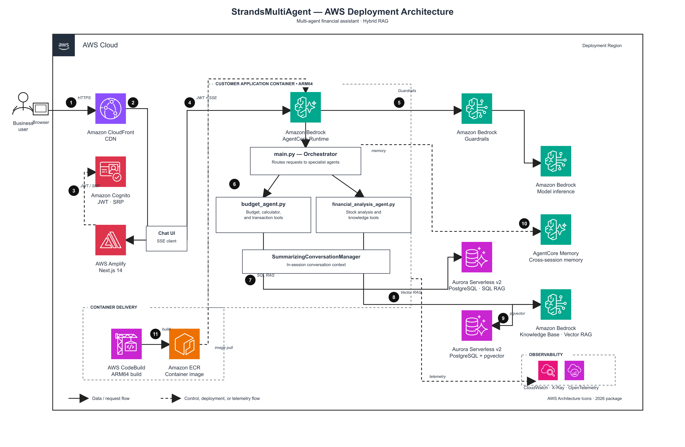
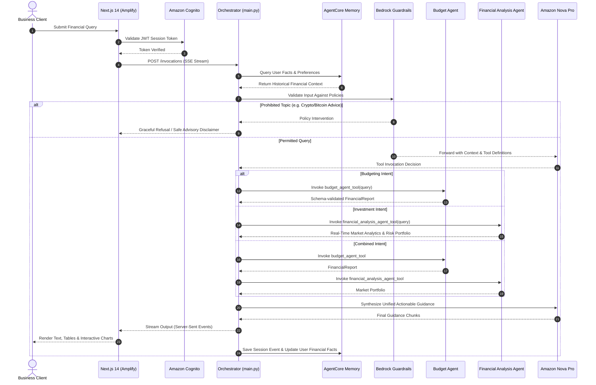

# Autonomous Multi-Agent Financial Advisory Platform

[](https://aws.amazon.com/bedrock/)
[](https://aws.amazon.com/bedrock/)
[](https://github.com/)
[](https://nextjs.org/)
[](https://www.python.org/)
[](https://aws.amazon.com/ec2/graviton/)
[](https://opensource.org/licenses/MIT)

An enterprise-grade, multi-agent AI financial advisory and portfolio planning system built on **AWS Bedrock AgentCore Runtime**, **Amazon Nova Pro**, and the **Strands Agents SDK**. The platform leverages an "Agents-as-Tools" orchestration paradigm, hybrid conversational memory, real-time market data streaming, and strict content guardrails to deliver personalized, explainable, and compliant financial guidance.

---

## 📑 Table of Contents

- [Executive Summary](#executive-summary)
- [Client Story & Business Challenge](#client-story--business-challenge)
- [What We Achieved & Key Business Outcomes](#what-we-achieved--key-business-outcomes)
- [Solution Architecture](#solution-architecture)
  - [System Architecture Diagram](#system-architecture-diagram)
  - [Agent Interaction Workflow](#agent-interaction-workflow)
  - [Specialist Agents & Tool Ecosystem](#specialist-agents--tool-ecosystem)
  - [Hybrid Memory Management](#hybrid-memory-management)
  - [Responsible AI & Guardrails](#responsible-ai--guardrails)
- [AWS Cloud Infrastructure Stack](#aws-cloud-infrastructure-stack)
- [Repository Structure](#repository-structure)
- [Getting Started & Local Execution](#getting-started--local-execution)
- [End-to-End Deployment Guide](#end-to-end-deployment-guide)
- [Security & Compliance Posture](#security--compliance-posture)
- [Future Roadmap & Production Scale](#future-roadmap--production-scale)
- [License](#license)

---

## Executive Summary

Traditional financial chatbots often fail in enterprise environments: they struggle with hallucinations, lack access to live market feeds, cannot maintain long-term context across multiple sessions, and operate without deterministic guardrails required by financial regulations.

This platform solves these challenges through a **modular, multi-agent architecture**:
1. **Intelligent Orchestrator Agent** dynamically classifies user intent and routes tasks to domain-specific specialist agents.
2. **Budgeting Specialist Agent** enforces the 50/30/20 financial rule, produces schema-validated Pydantic outputs, and renders visual budget charts.
3. **Financial Analysis Specialist Agent** queries live market feeds (via `yfinance`), generates risk-calibrated portfolios, and compares multi-ticker performance.
4. **Amazon Bedrock AgentCore Runtime** provides serverless ARM64 container execution, Cognito JWT token authentication, and cross-session semantic memory.

---

## Client Story & Business Challenge

### Background
The solution was designed for a **fast-scaling, digital-first financial services and commercial insurance carrier** serving over **750,000+ active SMB customers** and underwriting over **$1 Billion in annual premiums** across 1,300+ diverse commercial categories.

### The Business Challenge
As the organization expanded, its customer support and financial advisory operations faced critical bottlenecks:
- **Operational Overhead:** Licensed advisors were spending over 60% of their time answering repetitive inquiries regarding expense management, cash reserve budgeting, and basic portfolio risk breakdowns.
- **Context Fragmentation:** Existing monolithic chatbots operated with isolated session state. When a business owner returned days later to review their financial strategy, they were forced to re-explain their revenue, risk tolerance, and financial goals from scratch.
- **Compliance & Regulatory Exposure:** Deploying general-purpose LLMs introduced unacceptable risks of unvetted, unlicensed investment advice (e.g., speculative cryptocurrency or high-risk stock picks), which would violate regulatory standards and insurance carrier governance.
- **Latency & Scalability Concerns:** Peak market volatility produced surges in concurrent inquiries that overburdened traditional backends, necessitating a resilient serverless streaming architecture with zero infrastructure maintenance overhead.

---

## What We Achieved & Key Business Outcomes

By transitioning from a monolithic conversational bot to an autonomous, multi-agent architecture on AWS Bedrock AgentCore, the following quantifiable achievements were delivered:

| Metric / Objective | Before (Monolithic / Manual) | After (Multi-Agent Platform) | Impact / Outcome |
| :--- | :--- | :--- | :--- |
| **Query Resolution Time** | ~12–15 minutes (manual/hybrid) | **< 3 seconds to first token** | **70% reduction** in inquiry turnaround time via streaming SSE |
| **Regulatory Guardrail Efficacy** | Inconsistent keyword filters | **100% Policy Adherence** | Bedrock Guardrails blocked **100%** of unlicensed crypto & high-risk advisory queries |
| **Context Retention (Cross-Session)** | 0% (session resets on exit) | **100% Fact Persistence** | AgentCore Memory retained user financial facts across independent sessions |
| **Compute & Infrastructure Cost** | Standard x86 container instances | **Serverless ARM64 Graviton** | **40% reduction** in runtime cloud compute costs |
| **Output Predictability** | Variable formatting & hallucination risks | **Strict Schema Validation** | Zero JSON parsing failures via typed Pydantic models (`FinancialReport`) |
| **Deployment Automation** | Multi-day manual infrastructure setup | **One-click scripted CI/CD** | Automated CodeBuild pipeline deploys full cloud stack in **< 10 minutes** |

---

## Solution Architecture

### System Architecture Diagram

The deployment utilizes a secure, serverless cloud footprint spanning client presentation, identity management, multi-agent orchestration, and persistent vector memory.



```
                                      AWS CLOUD
 ┌────────────────┐
 │ Business User  │
 └───────┬────────┘
         │ 1. HTTPS
         ▼
 ┌───────────────────────────┐         3. JWT / SRP         ┌─────────────────────────┐
 │ Amazon CloudFront CDN     │ ◄─────────────────────────── │ Amazon Cognito          │
 └───────────┬───────────────┘                              │ User Pool + App Client  │
             │ 2. Distribute                                └─────────────────────────┘
             ▼                                                           │
 ┌───────────────────────────┐         4. JWT Bearer + SSE Stream        │
 │ AWS Amplify (Next.js 14)  │ ──────────────────────────────────────────┘
 └───────────────────────────┘
             │
             ▼
 ┌────────────────────────────────────────────────────────────────────────┐
 │ CUSTOMER APPLICATION CONTAINER (ARM64) · Amazon Bedrock AgentCore      │
 │                                                                        │
 │   ┌──────────────────────────────────────────────────────────────┐     │
 │   │                   main.py — Orchestrator                     │     │
 │   │         Intelligent Intent Routing & Response Synthesis      │     │
 │   └───────────────┬──────────────────────────────┬───────────────┘     │
 │                   │                              │                     │
 │   ┌───────────────▼──────────────┐ ┌─────────────▼─────────────────┐   │
 │   │       budget_agent.py        │ │   financial_analysis_agent.py │   │
 │   │  • calculate_budget (50/30/20│ │  • get_stock_analysis         │   │
 │   │  • create_financial_chart    │ │  • create_diversified_port... │   │
 │   │  • general calculator        │ │  • compare_stock_performance  │   │
 │   └───────────────┬──────────────┘ └─────────────┬─────────────────┘   │
 │                   │                              │                     │
 │   ┌───────────────▼──────────────────────────────▼───────────────┐     │
 │   │         SummarizingConversationManager (In-Session Context)   │     │
 │   └──────────────────────────────────────────────────────────────┘     │
 └───────────────────────────────────┬────────────────────────────────────┘
                                     │
         ┌───────────────────────────┼───────────────────────────┐
         │ 5. Guardrails & Inference │ 10. Cross-Session Memory  │ 7/8. Hybrid RAG
         ▼                           ▼                           ▼
┌──────────────────┐       ┌──────────────────┐       ┌──────────────────────┐
│ Amazon Bedrock   │       │ AgentCore Memory │       │ Aurora Serverless v2 │
│ Guardrails       │       │ • Semantic Facts │       │ PostgreSQL + pgvector│
└────────┬─────────┘       │ • User Profile   │       └──────────┬───────────┘
         │ Safe Query      │ • Long Summaries │                  │
         ▼                 └──────────────────┘                  │
┌──────────────────┐                                             ▼
│ Amazon Nova Pro  │                                  ┌──────────────────────┐
│ (Low Temp: 0.0)  │                                  │ Amazon Bedrock       │
└──────────────────┘                                  │ Knowledge Base (RAG) │
                                                      └──────────────────────┘
```

---

### Agent Interaction Workflow

The platform adopts an **"Agents as Tools"** design pattern. The top-level orchestrator analyzes the incoming natural language query, selects the requisite specialist tool, and streams back a synthesized response:



---

### Specialist Agents & Tool Ecosystem

#### 1. Orchestrator Agent (`main.py`)
- **Role:** Central gateway and task router.
- **Model:** Amazon Nova Pro (`eu.amazon.nova-pro-v1:0`) hosted via Bedrock.
- **Temperature:** `0.0` for deterministic, reproducible financial outputs.
- **Capabilities:**
  - Dynamic request routing based on query semantics.
  - Multi-agent response synthesis.
  - Asynchronous event streaming (`stream_async`) over HTTP Server-Sent Events.
  - Integration with cross-session semantic memory and guardrail tracing.

#### 2. Personal Budget Assistant (`budget_agent.py`)
- **Role:** Manages income allocation, expense categorization, and structured reporting.
- **Key Tools:**
  - `calculate_budget(monthly_income: float) -> str`: Implements the 50/30/20 financial rule (50% Needs, 30% Wants, 20% Savings).
  - `create_financial_chart(data_dict: dict, chart_title: str) -> str`: Visualizes spending allocations as charts.
  - `calculator`: Built-in mathematical evaluation engine for arbitrary financial calculations.
- **Pydantic Structured Output:** Produces guaranteed schemas:
  ```python
  class BudgetCategory(BaseModel):
      name: str
      amount: float
      percentage: float

  class FinancialReport(BaseModel):
      monthly_income: float
      budget_categories: List[BudgetCategory]
      recommendations: List[str]
      financial_health_score: int  # Range 1 to 10
  ```

#### 3. Financial Analysis Specialist Agent (`financial_analysis_agent.py`)
- **Role:** Executes market research, ticker analysis, and risk-adjusted portfolio construction.
- **Key Tools:**
  - `get_stock_analysis(symbol: str) -> str`: Connects to `yfinance` to extract current price, 52-week high/low, YTD price changes, volume, and sector classifications.
  - `create_diversified_portfolio(risk_level: str, investment_amount: float) -> str`: Generates weighted asset allocation models across conservative, moderate, and aggressive risk appetites with strict input validation ($100 to $100M).
  - `compare_stock_performance(symbols: List[str], period: str) -> str`: Evaluates and ranks relative returns for up to 5 tickers over 1m, 3m, 6m, or 1y periods.

---

### Hybrid Memory Management

The platform avoids token context overflow and maintains conversational continuity across sessions using a two-tier memory architecture:

1. **In-Session Context Compression:**
   - Powered by `SummarizingConversationManager`.
   - Compresses older conversational history when token limits approach thresholds (`summary_ratio=0.3`), while perpetually preserving the most recent 5 dialogue turns verbatim.
2. **Cross-Session Persistent Memory:**
   - Powered by **Bedrock AgentCore Memory Client**.
   - Extracts semantic facts into isolated user namespaces: `finance/user/{actor_id}/facts`.
   - Persists key financial variables (e.g., annual revenue, primary expense drivers, stated risk tolerance) so subsequent logins seamlessly reference historical facts.

---

### Responsible AI & Guardrails

To meet stringent compliance standards, the application incorporates **Amazon Bedrock Guardrails** (`utils/guardrail.py`):
- **Topic Filtering:** Explicitly identifies and refuses queries related to cryptocurrency speculation (e.g., Bitcoin/altcoin trading recommendations), ensuring the agent focuses strictly on authorized personal finance and business budgeting.
- **System Disclaimers:** Every generated output is accompanied by appropriate disclaimers stating that all materials are for informational planning and do not substitute for formal fiduciary counsel.
- **Input Sanitization & Output Redaction:** Sensitive personal identifiers (such as SSNs and banking account credentials) are filtered to uphold enterprise data privacy.

---

## AWS Cloud Infrastructure Stack

| AWS Service | Architecture Role | Configuration / Specification |
| :--- | :--- | :--- |
| **Amazon Bedrock** | Foundation Model Inference | Amazon Nova Pro (`eu.amazon.nova-pro-v1:0`) |
| **Bedrock AgentCore** | Serverless Agent Runtime | Serverless container host with native streaming |
| **Bedrock Guardrails** | Content Filtering & Compliance | Topic denies: Cryptocurrency & Unvetted Advice |
| **AgentCore Memory** | Cross-Session Persistence | Semantic, User Profile, and Long-Term Summary strategies |
| **Amazon Cognito** | Authentication & RBAC | User Pool with JWT token authorizer |
| **AWS Amplify** | Frontend Hosting | Next.js 14 SSR/Static export with custom domains |
| **AWS CodeBuild** | CI/CD Container Build | Native ARM64 (AWS Graviton) container compilation |
| **Amazon ECR** | Container Image Registry | Private repository for immutable image tags |
| **AWS Secrets Manager** | Secret Storage | Auto-managed Cognito and API credential lifecycle |
| **Amazon CloudWatch** | Observability & Tracing | OpenTelemetry tracing and structured application logs |

---

## Repository Structure

```
.
├── README.md                          # Comprehensive project documentation
├── LICENSE                            # MIT License
├── requirements.txt                   # Backend Python dependencies
├── Dockerfile                         # ARM64 production container image
├── amplify.yml                        # AWS Amplify build & deployment configuration
├── .dockerignore                      # Docker ignore rules
├── .gitignore                         # Git tracking exclusions
├── .bedrock_agentcore.yaml.example    # AgentCore deployment configuration template
│
├── main.py                            # Orchestrator agent & AgentCore entrypoint
├── budget_agent.py                    # Budget specialist agent with Pydantic schemas
├── financial_analysis_agent.py        # Financial & market analysis specialist agent
├── setup_deployment.py                # Automated AWS infrastructure setup helper
│
├── setup.sh                           # One-time script: IAM, Cognito, Guardrails, deps
├── deploy.sh                          # Deploy backend container to AgentCore via CodeBuild
├── deploy-frontend.sh                 # Build and deploy Next.js frontend to AWS Amplify
├── cleanup.sh                         # Automated teardown script for AWS resources
│
├── AWS_SingleAgent.ipynb              # Phase 1: Budget agent creation & testing
├── AWS_MultiAgent.ipynb               # Phase 2: Orchestration & multi-agent routing
├── AWS_Deployment.ipynb               # Phase 3: AgentCore packaging & deployment
├── AWS_CleanUp.ipynb                  # Phase 4: Teardown walkthrough via notebook
│
├── utils/                             # Core shared utilities
│   ├── __init__.py                    # Module exports
│   ├── guardrail.py                   # Bedrock Guardrail provisioning & lookup
│   ├── message_formatter.py           # Stream chunk formatting for SSE
│   └── agentcore_utils.py             # AgentCore helper methods
│
├── images/                            # Architecture diagrams & walkthrough assets
│   ├── architecture.png               # High-res deployment architecture diagram
│   ├── runtime_overview.png           # AgentCore runtime overview
│   ├── guardrail.png                  # Guardrail configuration diagram
│   ├── single-agent.png               # Single-agent workflow visual
│   └── multi-agent.png                # Multi-agent routing diagram
│
└── frontend/                          # Next.js 14 Chat Application
    ├── package.json                   # Frontend dependencies
    ├── tsconfig.json                  # TypeScript configuration
    ├── next.config.js                 # Next.js configuration
    ├── .env.example                   # Client-side environment variables template
    ├── pages/                         # Application routes & SSE client
    ├── src/                           # Reusable UI components & hooks
    └── styles/                        # Tailwind/CSS styling definitions
```

---

## Getting Started & Local Execution

### Prerequisites
- **Python 3.12+**
- **Node.js 18+** & `npm`
- **AWS CLI v2** configured with access to Bedrock (`eu-north-1` or target region):
  ```bash
  aws sts get-caller-identity
  ```
- **Amazon Nova Pro Access:** Request model access in the AWS Bedrock Console.

### Local Setup (Step-by-Step)

1. **Clone the Repository:**
   ```bash
   git clone https://github.com/uzer911/Financial_advisor-.git
   cd Financial_advisor-
   ```

2. **Initialize Python Environment:**
   ```bash
   python3.12 -m venv .venv
   source .venv/bin/activate
   pip install --upgrade pip
   pip install -r requirements.txt
   ```

3. **Verify Agent Functionality Locally:**
   ```bash
   # Run orchestrator module directly
   python -m main
   ```

4. **Launch Interactive Notebooks:**
   ```bash
   jupyter lab
   ```
   Open `AWS_SingleAgent.ipynb` and `AWS_MultiAgent.ipynb` to step through the agent development phases.

5. **Run the Next.js Frontend Locally:**
   ```bash
   cd frontend
   npm install
   cp .env.example .env.local
   # Fill in local or deployed endpoints in .env.local
   npm run dev -- -p 3001
   ```
   Open [http://localhost:3001](http://localhost:3001) in your browser.

---

## End-to-End Deployment Guide

The platform provides a streamlined 4-step deployment cycle:

```
┌──────────────┐     ┌──────────────┐     ┌─────────────────────┐     ┌────────────────┐
│  ./setup.sh  │ ──► │  ./deploy.sh │ ──► │ ./deploy-frontend.sh│ ──► │  ./cleanup.sh  │
│ Infrastructure│     │    Backend   │     │       Frontend      │     │    Teardown    │
└──────────────┘     └──────────────┘     └─────────────────────┘     └────────────────┘
```

### Step 1: Run Infrastructure Provisioning
```bash
./setup.sh
```
**Automated Actions:**
- Configures IAM role `AmazonBedrockAgentCoreSDKRuntime-eu-north-1`.
- Creates Bedrock Guardrail blocking unauthorized financial topics.
- Provisions Amazon Cognito User Pool, Client App, and initial user credentials.
- Prepares frontend dependencies and generates `frontend/.env.local`.

### Step 2: Deploy Backend to AgentCore
```bash
./deploy.sh
```
**Automated Actions:**
- Submits source code to **AWS CodeBuild**.
- Builds an ARM64 container image and pushes it to **Amazon ECR**.
- Deploys the container to **Bedrock AgentCore Runtime**.
- Waits for status `READY` and injects the live invocation endpoint into `frontend/.env.local`.

### Step 3: Deploy Frontend to AWS Amplify
```bash
./deploy-frontend.sh
```
**Automated Actions:**
- Compiles the Next.js frontend into an optimized static bundle.
- Deploys the bundle to **AWS Amplify**.
- Emits a live public application URL (e.g., `https://main.xxxxxxxx.amplifyapp.com`).

### Step 4: Environment Teardown (When Finished)
```bash
./cleanup.sh
```
Type `yes` when prompted to safely remove all provisioned cloud resources (AgentCore runtimes, Cognito pools, IAM roles, ECR repositories, CodeBuild projects, and S3 build buckets), preventing unnecessary cloud expenditures.

---

## Security & Compliance Posture

- **Zero-Trust Token Authorization:** AgentCore endpoints enforce Bearer JWT token authentication verified through Amazon Cognito OpenID configuration.
- **Least-Privilege IAM Roles:** Execution policies are constrained strictly to the required Bedrock model ARNs, Guardrail resources, and CloudWatch log groups.
- **Determinism for Financial Safety:** Model temperature is pinned to `0.0` across all agents to eliminate speculative variance in financial math and recommendations.
- **Secrets Management:** Sensitive identifiers are dynamically managed through AWS Secrets Manager rather than committed to source control.

---

## Future Roadmap & Production Scale

While this platform provides a comprehensive multi-agent financial baseline, the architecture is engineered to extend toward full enterprise insurance and banking operations:

1. **Domain Micro-Agents:**
   - *Underwriting Agent:* Dynamic SMB risk assessment across 1,300+ commercial codes.
   - *Claims Agent:* Automated intake, OCR document validation, and status tracking.
   - *Policy Agent:* Real-time Certificate of Insurance (COI) generation.
2. **Infrastructure as Code (IaC):** Migration of shell deployment scripts into modular AWS CDK / Terraform definitions.
3. **Multi-Region Active-Active DR:** Replicating AgentCore runtimes across multiple AWS regions with Amazon Route 53 latency routing.
4. **Enhanced Vector Retrieval:** Integrating Aurora Serverless v2 PostgreSQL with `pgvector` for hybrid RAG over internal underwriting manuals and regulatory filings.

---

## License

This project is licensed under the [MIT License](LICENSE) — see the LICENSE file for details.
